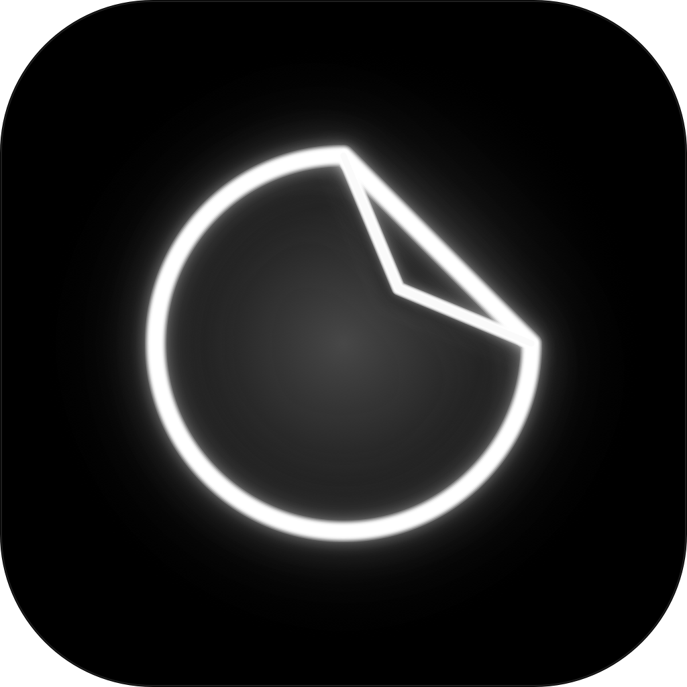
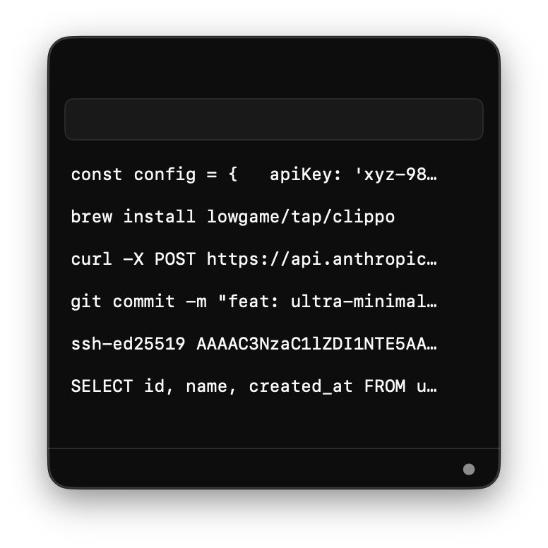
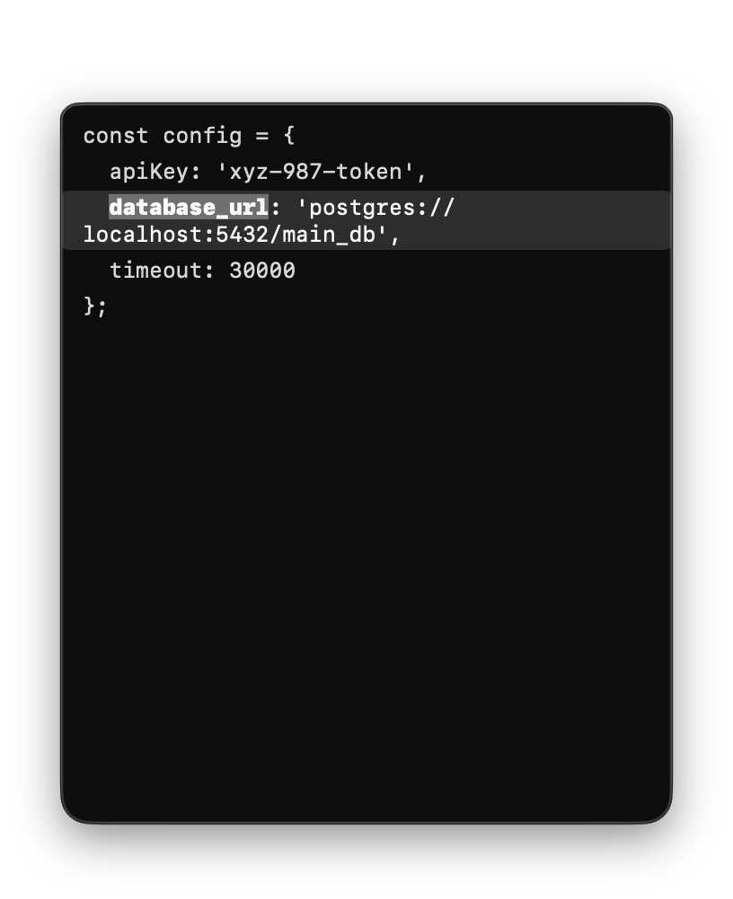
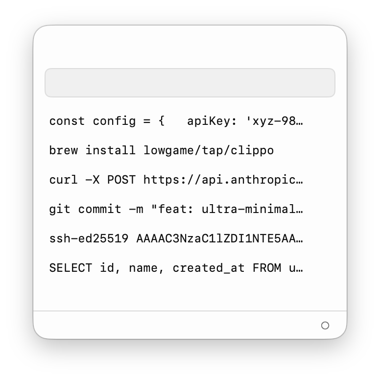

<div align="center">

# CLIPPO

### as minimal as possible clipboard history for macos bar

[](https://github.com/lowgame/clippo/releases/latest)
[](https://github.com/lowgame/clippo)
[](LICENSE)
[](https://x.com/hiimthelowgame)

<br/><br/>



<br/><br/>

<p align="center">
  
  
  
</p>

*Strictly 3 colors. Zero icons. Zero clutter. Pure typographic geometry.*

</div>

---

## Design Principles

- **Less, but better** ([Dieter Rams](https://www.vitsoe.com/us/about/good-design)): Zero preview bloat, cloud databases, or heavy web runtimes. Pure clipboard memory.
- **Data-Ink Ratio** ([Edward Tufte](https://www.edwardtufte.com/books/)): Every pixel is state. Zero decorative cards, bloated thumbnails, or artificial borders.
- **Grid Discipline** ([Massimo Vignelli](https://archive.org/details/thevignellicanon)): Strict typographical geometry, pixel-perfect purge, monospaced layout. Strictly `#000000`, `#8E8E93`, `#FFFFFF`.
- **Zero Friction** ([Hick's Law](https://doi.org/10.1080/17470215208416600)): Instant 1..9 selection, seamless sidecar hover expansion, armored two-click purge, sub-millisecond launch.

---

## Features

- **Menu Bar Resident**: Summon instantly from macOS status bar with a bespoke Bauhaus template glyph.
- **Sidecar Full-Text Preview**: Hover over any truncated clip to inspect its complete text in an adjacent, scrollable preview panel.
- **Instant Search & In-Text Navigation**: Search your history instantly; press `Enter` to cycle across occurrences with auto-scrolled line highlights.
- **Instant 1..9 Selection**: Press any number `1..9` to immediately copy that item to your clipboard and dismiss.
- **Two-Click Armored Purge (`×`)**: Click `×` once to arm with zero layout shift, twice to permanently purge. Zero dialogs.
- **Privacy & Sensitive Data Filtering**: Automatically detects and ignores passwords, credentials, and transient tokens copied from password managers (1Password, Bitwarden, Apple Passwords, Keychain, etc.).
- **Monochrome Themes (`⌘D`)**: High-contrast Dark, Light, and System modes crafted for LiquidGlass material physics.
- **Local-First with iCloud Sync**: Instant local speed via `~/Library/Application Support/clippo/history.json` with seamless background iCloud Drive mirroring.
- **Featherweight**: Native Swift, SwiftUI, AppKit & CoreGraphics. Under 1 MB binary.

---

## Shortcuts

| Shortcut | Action | Scope |
| :--- | :--- | :--- |
| `1..9` | Copy indexed clip & dismiss | Local |
| `Enter` | Cycle next search match / Copy selection | Local |
| `↑` / `↓` | Navigate clips | Local |
| `⌘D` | Toggle Dark / Light / System theme | Local |
| `esc` | Dismiss popover panel | Local |

---

## Installation

Download **[clippo.dmg](https://github.com/lowgame/clippo/releases/latest)**, drag **clippo.app** to `/Applications`, and open.

*(If macOS shows an unnotarized app prompt on first launch, right-click `clippo.app` and select **Open**).*

```bash
# Or install via Homebrew
brew install lowgame/tap/clippo

# Or build from source
git clone https://github.com/lowgame/clippo.git && cd clippo && ./Scripts/create_dmg.sh
```

---

## Author & License

Created by **Ahmet Kamer** — [@hiimthelowgame](https://x.com/hiimthelowgame) on X · [@lowgame](https://github.com/lowgame) on GitHub.  
Released under the [MIT License](LICENSE).
